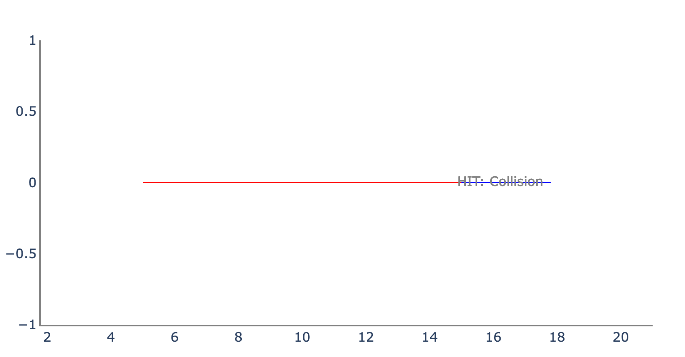

## Modeling and Verification of Multi-Agent Cyber-Physical Systems in Verse : A Case Study
Submitted to ISEC 2024.

### Abstract

[Verse](https://github.com/AutoVerse-ai/Verse-library) is a recent Python library that aims to make modeling and verification of multi-agent CPS more accessible. Leveraging the extensive Python community, Verse has the potential to broaden the user base for CPS verification. In this paper, we study the Verse library and its capabilities through a case study in robotics, demonstrating its differences from the conventional hybrid automata modeling. In the case study, we propose a hybrid model for a swarm robotic system that achieves mutual synchronization while having fewer locations and transitions as compared to existing models, thereby making its reachability analysis easier.

### ACC

Our source code for ACC can be found here. Additionally, we provide some plots.

1. For the initial condition:
* $x = 5$, $y = 0$, $vx = 28$, $ax = 0$ for the ego;
* $x = 15$, $y = 0$, $vx = 28$, $ax = 0$ for the lead;

we plot y vs. x:

and x vs. t:

2. For the initial condition range:
* $x \in [0,5]$, $y = 0$, $vx \in [0,15]$, $ax = 0$ for the ego;
* $x \in [7.5,20]$, $y = 0$, $vx = 28$, $ax = 0$ for the lead;

we plot y vs. x:

and x vs. t:

